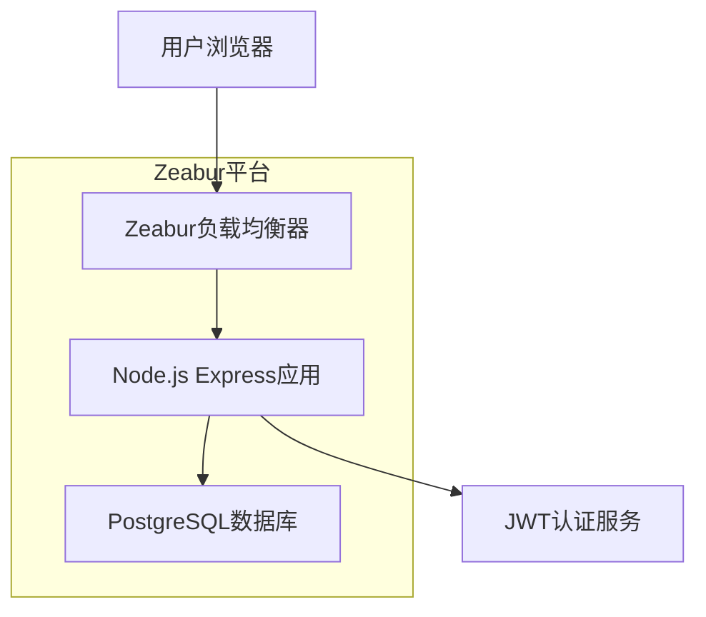

# Design Document

## Overview

本设计文档描述了一个部署在Zeabur平台上的Node.js服务器演示应用。该应用使用Express.js框架构建，集成PostgreSQL数据库，并提供基于JWT的邮箱登录功能。设计重点关注简洁性和快速部署，适合作为项目原型或学习演示。

## Architecture

### 系统架构图



### 技术栈选择

- **运行时**: Node.js 18+
- **Web框架**: Express.js
- **数据库**: PostgreSQL (Zeabur托管)
- **认证**: JWT (JSON Web Tokens)
- **密码加密**: bcrypt
- **数据库ORM**: pg (node-postgres)
- **环境配置**: dotenv
- **部署平台**: Zeabur

## Components and Interfaces

### 1. 应用入口 (app.js)
- 初始化Express应用
- 配置中间件 (CORS, JSON解析, 日志)
- 设置路由
- 启动服务器

### 2. 数据库连接模块 (db/connection.js)
- PostgreSQL连接池管理
- 连接健康检查
- 错误处理和重连机制

### 3. 用户模型 (models/User.js)
- 用户数据结构定义
- 密码加密/验证方法
- 用户查询和创建方法

### 4. 认证中间件 (middleware/auth.js)
- JWT令牌验证
- 受保护路由的访问控制
- 用户身份提取

### 5. API路由
#### 认证路由 (routes/auth.js)
- POST /api/auth/register - 用户注册
- POST /api/auth/login - 用户登录

#### 用户路由 (routes/user.js)
- GET /api/user/profile - 获取用户信息 (需认证)

#### 系统路由 (routes/system.js)
- GET /health - 健康检查
- GET /api/status - 系统状态

## Data Models

### User表结构
```sql
CREATE TABLE users (
    id SERIAL PRIMARY KEY,
    email VARCHAR(255) UNIQUE NOT NULL,
    password_hash VARCHAR(255) NOT NULL,
    created_at TIMESTAMP DEFAULT CURRENT_TIMESTAMP,
    updated_at TIMESTAMP DEFAULT CURRENT_TIMESTAMP
);
```

### JWT Payload结构
```javascript
{
    userId: number,
    email: string,
    iat: number,
    exp: number
}
```

## Error Handling

### 错误分类和处理策略

1. **数据库连接错误**
   - 记录详细错误日志
   - 返回500内部服务器错误
   - 实现重连机制

2. **认证错误**
   - 401 未授权 - 无效或过期的JWT
   - 403 禁止访问 - 权限不足

3. **验证错误**
   - 400 请求错误 - 邮箱格式无效、密码不符合要求
   - 409 冲突 - 邮箱已存在

4. **全局错误处理中间件**
   - 统一错误响应格式
   - 错误日志记录
   - 生产环境下隐藏敏感信息

### 错误响应格式
```javascript
{
    success: false,
    error: {
        code: "ERROR_CODE",
        message: "用户友好的错误信息",
        details: "开发环境下的详细信息"
    }
}
```

## Testing Strategy

### 单元测试
- 用户模型的密码加密/验证功能
- JWT令牌生成和验证
- 数据库查询方法

### 集成测试
- API端点的完整请求/响应流程
- 数据库操作的事务完整性
- 认证中间件的访问控制

### 端到端测试
- 用户注册流程
- 用户登录流程
- 受保护资源访问

### 测试工具
- Jest - 测试框架
- Supertest - HTTP断言测试
- 测试数据库 - 独立的PostgreSQL实例

## Deployment Configuration

### Zeabur部署配置

#### package.json脚本
```json
{
    "scripts": {
        "start": "node app.js",
        "dev": "nodemon app.js",
        "test": "jest"
    }
}
```

#### 环境变量配置
- `DATABASE_URL` - PostgreSQL连接字符串
- `JWT_SECRET` - JWT签名密钥
- `PORT` - 服务器端口 (默认3000)
- `NODE_ENV` - 运行环境

#### Zeabur检测文件
- 确保package.json存在
- 设置正确的启动脚本
- 配置Node.js版本

### 数据库初始化
- 创建数据库表的SQL脚本
- 数据库迁移策略
- 初始数据种子 (可选)

## Security Considerations

虽然这是一个简化的演示版本，但仍包含基本的安全措施：

1. **密码安全**
   - 使用bcrypt进行密码哈希
   - 不在响应中返回密码哈希

2. **JWT安全**
   - 设置合理的过期时间
   - 使用强随机密钥

3. **输入验证**
   - 邮箱格式验证
   - 基本的密码强度要求

4. **CORS配置**
   - 适当的跨域资源共享设置

注意：此演示版本不包含高级安全功能如速率限制、HTTPS强制、SQL注入防护等。